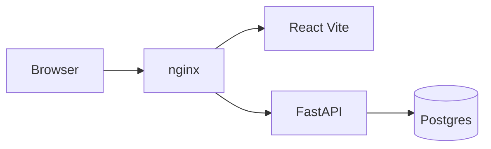

# `<your-project>`

A starter template for **`<your-project>`**: a **FastAPI** backend with **Postgres**, a **React** web app (Vite + TypeScript), an **Electron** desktop shell, and **nginx** as the single entry point. Local development and production-style runs use **Docker Compose** only—no host Python venv or Conda required.

---

## Prerequisites

- [Docker](https://docs.docker.com/get-docker/) and Docker Compose v2
- Git (optional, for cloning)

---

## Configuration

Copy the example env files and fill in placeholders:

```bash
cp .env.example .env
cp apps/backend/.env.example apps/backend/.env
```

| File | Purpose |
|------|---------|
| [`.env.example`](.env.example) | Database credentials, `NGINX_PORT`, `VITE_API_URL` |
| [`apps/backend/.env.example`](apps/backend/.env.example) | JWT secret, cookie names, CORS origins |

Set at least: `DB_PASSWORD`, `JWT_SECRET`, and `VITE_API_URL=/api`. See the example files for other keys.

---

## Quick start (development)

From the repository root:

```bash
docker compose -f docker-compose.yml -f docker-compose.dev.yml up --build
```

- **Web app:** [http://localhost](http://localhost) (or `http://localhost:${NGINX_PORT}` if you changed it)
- **API docs:** [http://localhost/api/docs](http://localhost/api/docs)
- **Health:** [http://localhost/health](http://localhost/health)

Compose starts Postgres, runs migrations, then backend, frontend (Vite with HMR), and nginx on the shared `app-network`. The **Electron** desktop app is not part of Compose yet—run it on the host or see [**`apps/desktop/README.md`**](apps/desktop/README.md) (**TODO**: dev service in Docker; production `.exe` installer downloaded from the web app).

---

## Quick start (production)

```bash
docker compose -f docker-compose.yml -f docker-compose.prod.yml up --build -d
```

Uses built backend and frontend images and [`apps/nginx/conf.d/web.prod.conf`](apps/nginx/conf.d/web.prod.conf). Tune `apps/backend/.env` for production (e.g. `COOKIE_SECURE=True`, real `CORS_ORIGINS`).

---

## Architecture



nginx proxies `/` to the web app and `/api/` to the API. Full diagrams, service list, and per-app roles are in [**`apps/README.md`**](apps/README.md).

---

## Documentation index

| README | Description |
|--------|-------------|
| [**`apps/README.md`**](apps/README.md) | Monorepo layout, architecture, Docker services |
| [**`apps/web/README.md`**](apps/web/README.md) | React frontend |
| [**`apps/backend/README.md`**](apps/backend/README.md) | FastAPI service |
| [**`apps/backend/app/README.md`**](apps/backend/app/README.md) | Python package layers (`api`, `services`, …) |
| [**`apps/backend/alembic/README.md`**](apps/backend/alembic/README.md) | Database migrations |
| [**`apps/desktop/README.md`**](apps/desktop/README.md) | Electron client (host dev today; Compose + web download **TODO**) |

---

## Repository layout

```
.
├── docker-compose.yml          # Shared network + service stubs
├── docker-compose.dev.yml      # Dev overlay (bind mounts, hot reload)
├── docker-compose.prod.yml     # Prod overlay (built images)
├── .env                        # Compose / DB / Vite (from .env.example)
└── apps/
    ├── web/                    # React SPA
    ├── backend/                # FastAPI + Alembic
    ├── desktop/                # Electron (host dev; Compose + .exe via web **TODO**)
    └── nginx/conf.d/           # Reverse proxy configs
```
