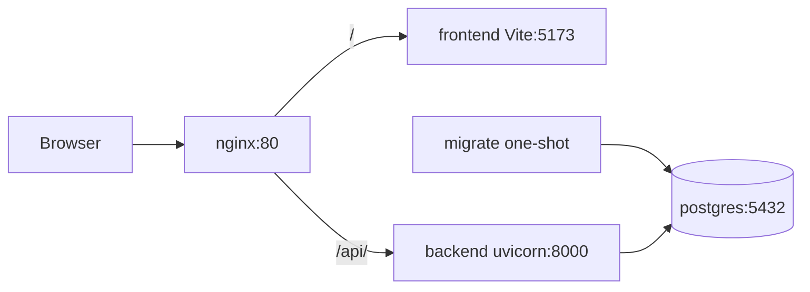

# `<your-project>` — Applications

The `apps/` directory holds the runnable pieces of **`<your-project>`**: web UI, API, desktop shell, and nginx reverse-proxy configuration. Web, API, and database development run through **Docker Compose** at the repository root (see [Quick start](../README.md#quick-start-development)).

---

## What lives here

| Path | Role |
|------|------|
| [`web/`](web/README.md) | React + TypeScript SPA (Vite) |
| [`backend/`](backend/README.md) | FastAPI API + Alembic migrations |
| [`desktop/`](desktop/README.md) | Electron client (**TODO**: Compose dev service; `.exe` via web download) |
| [`nginx/conf.d/`](nginx/conf.d/) | Dev/prod nginx configs (proxied by Compose `nginx` service) |

---

## Architecture (development)

In development, the browser talks to a single origin. **nginx** terminates HTTP and routes traffic to the Vite dev server or the FastAPI backend. **Postgres** stores data; a one-shot **migrate** job applies Alembic revisions before the backend starts.

The Electron desktop app is developed on the host for now and is not in the Compose stack yet (see [Desktop (Electron)](#desktop-electron)).

**Request path**

1. `GET /`, static assets, HMR → `frontend` (Vite on port 5173 inside the network).
2. `GET|POST /api/...` → `backend` (Uvicorn on port 8000). Nginx strips the `/api` prefix when proxying (see [`nginx/conf.d/web.dev.conf`](nginx/conf.d/web.dev.conf)).
3. Backend uses SQLAlchemy against `postgres` on the `app-network` bridge.

**Entry URL:** `http://localhost` (or `http://localhost:${NGINX_PORT}` if overridden in the root `.env`).

**API base URL for the web app:** set `VITE_API_URL=/api` in the root `.env` so the browser calls the same origin nginx exposes.

---

## Docker services (dev vs prod)

Compose merges [`docker-compose.yml`](../docker-compose.yml) with an environment overlay:

| Overlay | Services (typical) |
|---------|-------------------|
| [`docker-compose.dev.yml`](../docker-compose.dev.yml) | `postgres`, `migrate`, `backend`, `frontend`, `nginx` — bind mounts, hot reload |
| [`docker-compose.prod.yml`](../docker-compose.prod.yml) | Same names — built images, static frontend, no host mounts |

Start and stop commands live in the [root README](../README.md#quick-start-development). This file does not duplicate full `docker compose` invocations.

**Nginx configs**

- Development: [`nginx/conf.d/web.dev.conf`](nginx/conf.d/web.dev.conf)
- Production: [`nginx/conf.d/web.prod.conf`](nginx/conf.d/web.prod.conf)

---

## Per-app documentation

- [**Web**](web/README.md) — React app, `VITE_API_URL`, folder layout
- [**Backend**](backend/README.md) — FastAPI service, env, logs
- [**Desktop**](desktop/README.md) — Electron (host dev; Compose + installer download **TODO**)

Backend internals:

- [Python package layout (`app/`)](backend/app/README.md)
- [Database migrations (`alembic/`)](backend/alembic/README.md)

---

## Desktop (Electron)

[`desktop/`](desktop/) is an Electron + Vite app, separate from the Compose dev stack today.

| Topic | Status |
|-------|--------|
| **Dev in Docker Compose** | **TODO** — no `desktop` service in [`docker-compose.dev.yml`](../docker-compose.dev.yml) yet |
| **Local dev** | Run `npm run dev` on the host against `http://localhost/api` while Compose runs web/API — see [`desktop/README.md`](desktop/README.md) |
| **Production** | **TODO** — bundle a Windows `.exe` installer (`npm run dist`) and let users download it from the web app |

---

## Environment files

Two files are required before `docker compose up`:

1. **Repository root** [`.env`](../.env.example) — `DB_*`, `NGINX_PORT`, `VITE_API_URL`
2. **Backend** [`backend/.env`](backend/.env.example) — JWT, cookies, CORS

See the [root README](../README.md#configuration) for setup steps.

---

## Not covered here

- Step-by-step migration commands → [`backend/alembic/README.md`](backend/alembic/README.md)
- Layered FastAPI folder conventions → [`backend/app/README.md`](backend/app/README.md)
